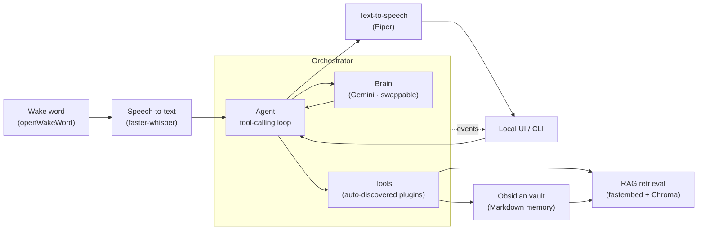

# Jarvis — a local-first, voice-driven personal AI assistant

> An assistant that **acts** on natural-language commands, **speaks** its replies,
> **remembers** everything it does in a plain-text Obsidian vault, and runs
> **entirely on your own machine**.

Not a chatbot wrapper. Jarvis is an agentic assistant with a real tool-calling
loop, hands-free wake-word activation, retrieval-augmented memory over its own
work history, an extensible plugin system, a reactive local UI and a native
desktop app — built in eight independently-shippable phases, with every external
dependency behind a swappable interface.

<!-- TODO: record a capture, save it as docs/demo.gif, then uncomment:

-->

---

## Why it's interesting

Most "AI assistant" projects are a thin call to one vendor's API. This one is
built like a system:

- **Interface-driven, vendor-swappable core.** The LLM, speech-to-text,
  text-to-speech, wake-word, embedder, and vector store each sit behind a small
  abstract interface. Switching from cloud Gemini to a local model — or from
  Chroma to pgvector — is a one-file change, not a rewrite. The project ships on
  Gemini's free tier; a local model would plug in behind the same interface
  without touching the agent.
- **Local-first by design.** Wake-word detection, speech-to-text, text-to-speech,
  embeddings, and the vector store all run on-device. The only things that leave
  the machine are what the LLM needs to answer (your command plus the results of
  the tools it calls) and web-search queries. The UI binds to `127.0.0.1` only.
- **Memory that's transparent.** Every task Jarvis performs is written as a
  linked Markdown note in an Obsidian vault — a human-browsable audit log that
  *doubles* as the corpus for semantic retrieval. One store, two jobs.
- **Engineered, not just working.** A confirmation gate guards every
  side-effecting action, a path-sandbox contains all filesystem access, a
  regression-eval harness catches tool-selection drift when models are swapped,
  and per-stage latency + token usage are logged for every turn.

---

## Architecture



Every box behind an interface is replaceable. The orchestrator emits an event
stream (state / transcript / tool / reply / audio-level) that any UI subscribes
to — which is why the interface evolved from a terminal to a localhost web panel
to a desktop app without the core ever changing.

---

## Tech stack

| Layer | Technology |
| --- | --- |
| Language / tooling | Python 3.12, `uv` |
| Config / schemas | Pydantic v2, pydantic-settings |
| Observability | structlog, per-turn metrics (JSONL), regression eval harness |
| Brain (LLM) | Google Gemini (free tier) behind an `LLMClient` interface |
| Agent | Custom async tool-calling loop (no framework) |
| Speech-to-text | faster-whisper (local) |
| Text-to-speech | Piper (local neural voice) / OS voice fallback |
| Wake word / VAD | openWakeWord ("hey_jarvis"), webrtcvad |
| Memory | Obsidian vault (Markdown) |
| Retrieval | fastembed (ONNX embeddings) + Chroma (local vector store) |
| UI | FastAPI + WebSocket → localhost panel (canvas orb) → Tauri v2 desktop shell |
| Packaging | PyInstaller (one-file backend) as a Tauri sidecar, NSIS installer |

---

## Features

- **Many ways to talk to it** — text REPL, push-to-talk voice, hands-free
  "Hey Jarvis" always-listening mode, a local web panel with a voice-reactive
  orb, and a desktop app with a tray icon and a global hotkey (Ctrl+Alt+J).
- **Acts, not just chats** — writes task notes, searches its own memory, searches
  the web, tells the time, sets reminders that fire, reads sandboxed local files.
- **Remembers its work** — ask *"what did I do about the wake-word module last
  week?"* and it retrieves the real notes and answers from them.
- **Extensible in one file** — dropping a new `Tool` subclass into `tools/`
  auto-registers it; no edits to the agent, registry, or CLI.
- **Safe by construction** — side-effecting tools require confirmation; all file
  access is path-sandboxed; the UI is loopback-only.
- **Observable** — every turn logs stage latencies and token usage; a `--metrics`
  view and `/metrics` endpoint aggregate them.
- **Resilient** — a failed turn gets a spoken apology (a specific one when the LLM
  is rate-limited) instead of a crash, and the desktop app restarts a crashed
  backend.

---

## Getting started

### Prerequisites
- Python 3.12 and [`uv`](https://docs.astral.sh/uv/)
- A free Gemini API key from [Google AI Studio](https://aistudio.google.com)
- (Voice) PortAudio — bundled with the `sounddevice` wheel on Windows and macOS;
  on Linux, `apt install libportaudio2`
- (Desktop app only) Rust, Node.js 18+, and on Windows the MSVC C++ Build Tools and
  WebView2 — see [desktop/README.md](desktop/README.md)
- An Obsidian vault folder (or any folder — Obsidian itself is optional to run)

### Setup
```bash
git clone https://github.com/Zorrow14/personal-assistant.git
cd personal-assistant
uv sync
cp .env.example .env      # then edit it (see below)
```

Set in `.env` (every setting except the API key has the `JARVIS_` prefix;
`.env.example` lists them all):
```
LLM_API_KEY=your_gemini_key
JARVIS_LLM_MODEL=gemini-2.5-flash
JARVIS_VAULT_PATH=/path/to/your/vault
JARVIS_TTS_PROVIDER=piper
JARVIS_TTS_VOICE=voices/en_GB-alan-medium.onnx
```

### Run
```bash
uv run python -m jarvis.cli               # text REPL
uv run python -m jarvis.cli --voice       # push-to-talk
uv run python -m jarvis.cli --wake        # hands-free "Hey Jarvis"
uv run python -m jarvis.cli --reindex     # build the memory index (run once)
uv run python -m jarvis.cli --serve       # local web panel at 127.0.0.1:8000
uv run python -m jarvis.cli --list-tools  # show discovered tools
uv run python -m jarvis.cli --metrics     # latency / token summary
uv run python -m jarvis.cli --health      # check config and vault
```

Run everything from the repo root: `.env` and `.jarvis/` are resolved relative to it.

### Desktop app
```bash
cd desktop
npm install
npm run dev      # native window + tray + Ctrl+Alt+J, backend started for you
npm run build    # Windows installer (NSIS) with the backend bundled
```
The app wraps the same panel as `--serve` and still binds `127.0.0.1` only.
Closing the window keeps Jarvis in the tray; *Quit* stops the backend too. There
is no terminal in the app, so actions that would ask for a `y/N` confirmation are
declined. Settings (port, hotkey, wake word, data folder) are in
[desktop/README.md](desktop/README.md).

### Tests and eval
```bash
uv run pytest                          # full suite, offline (no mic, no API calls)
uv run python eval/run.py --fake       # tool-selection eval with a scripted LLM
uv run python eval/run.py              # the same cases against the real model
```

---

## How it was built

Eight phases, each a working milestone on its own:

| Phase | What it added |
| --- | --- |
| 0 | Foundations — scaffolding, config, logging, vault writer, interfaces |
| 1 | Text brain + first tool (the agentic MVP) |
| 2 | Voice — speech-to-text + text-to-speech (push-to-talk) |
| 3 | Wake word + always-listening loop |
| 4 | RAG memory over the Obsidian vault |
| 5 | Extensible plugin tool system |
| 6 | Local UI (reactive orb) + MLOps polish (metrics, eval, resilience) |
| 6.5 | Tauri desktop app (tray + global hotkey) |

---

## Skills demonstrated

Agentic LLM tool-calling · retrieval-augmented generation · interface-driven
architecture and dependency inversion · real-time audio pipelines · local model
inference · evaluation harness design · latency/cost observability · secure
tool-execution boundaries · full-stack (FastAPI + WebSocket + canvas UI) ·
desktop packaging.

---

## Project structure

```
src/jarvis/
├── config.py            # typed settings
├── logging.py
├── cli.py               # entrypoint: text / --voice / --wake / --serve / …
├── sidecar.py           # backend entrypoint for the desktop app
├── core/
│   ├── interfaces.py    # LLMClient, STTEngine, TTSEngine, WakeWordDetector, …
│   ├── agent.py         # async tool-calling loop + confirmation gate
│   ├── voice_loop.py    # wake→listen→think→speak state machine
│   ├── scheduler.py     # fires due reminders
│   └── events.py        # event bus feeding the UI
├── llm/gemini_client.py # concrete provider (swappable)
├── stt/ · tts/ · wakeword/ · audio/
├── memory/              # vault writer, embedder, vector store, indexer
├── tools/               # auto-discovered Tool plugins
├── obs/metrics.py       # per-turn latency + token metrics
└── server/              # FastAPI + static panel
eval/                    # regression harness (offline + live)
packaging/               # PyInstaller spec for the one-file backend
desktop/                 # Tauri v2 app: window, tray, hotkey, backend supervisor (Rust)
```

---

## License

Personal / portfolio project. Note that some bundled voice models (e.g. Piper's
`alan`) are licensed for personal, non-commercial use — check each model's card
before any other use.

---

*Built by [Zorrow](https://github.com/Zorrow14) · [portfolio](https://htet-aung-lwin-portfolio.vercel.app)*
